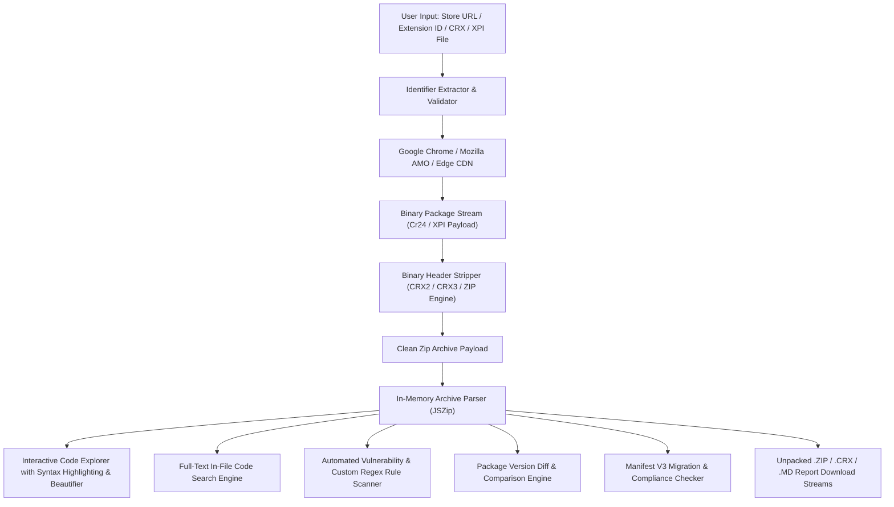

> [!NOTE]
> **[GetCRX is Live](https://getcrx.vercel.app):** In-browser Chrome & Firefox Extension unpacker, live code explorer, JS beautifier, version diff engine, vulnerability scanner, hardcoded secret detector, and security auditor.

# GetCRX — Unpacked
### High-Performance Browser Extension Extractor & Security Inspector

**Extract, inspect, beautify, search, diff, and audit the source code and security attack surface of any Chrome Web Store or Firefox Add-on extension in real-time.**

 

---

> [!TIP]
> **Use the official hosted application:** Access the tool directly at **[getcrx.vercel.app](https://getcrx.vercel.app)**. No installation or account is required.

---

## Table of Contents

- [Overview](#overview)
- [Key Features](#key-features)
- [Deep Security & Custom Rule Scanner](#deep-security--custom-rule-scanner)
- [Version Diff & Supply Chain Auditor](#version-diff--supply-chain-auditor)
- [Interactive Code Explorer & Beautifier](#interactive-code-explorer--beautifier)
- [Manifest V3 Migration Readiness](#manifest-v3-migration-readiness)
- [Cross-Browser Support](#cross-browser-support)
- [Architecture](#architecture)
- [How It Works](#how-it-works)
- [Quick Guide](#quick-guide)
- [Privacy & Compliance](#privacy--compliance)
- [Frequently Asked Questions](#frequently-asked-questions)
- [Terms & Intellectual Property](#terms--intellectual-property)
- [Author](#author)

---

## Overview

**GetCRX** is an in-browser platform engineered for security researchers, bug bounty hunters, extension developers, and reverse engineers to instantly fetch, unpack, inspect, diff, and audit Google Chrome, Edge, and Firefox browser extensions.

Paste any Chrome Web Store link, Firefox Add-on URL, or 32-character extension ID. GetCRX communicates with Google and Mozilla public update infrastructure, strips binary container headers (CRX2/CRX3/XPI), and delivers the clean unpacked source as a `.zip` archive or directly inside an interactive, syntax-highlighted code explorer equipped with 1-click code beautification, real-time vulnerability scanning, custom regex rule auditing, version diffing, and MV3 health scoring.

---

## Key Features

- **⚡ Instant Binary Unpacking:** Converts signed `.crx`, `.xpi`, and `.zip` packages to clean source code in milliseconds.
- **🧪 CSP (Content Security Policy) Deep Evaluator:** Parses MV2 string and MV3 dictionary CSPs, evaluating `script-src`, `connect-src`, and flagging `'unsafe-eval'`, `'unsafe-inline'`, and wildcards.
- **🔐 Cryptographic Hashes & Fingerprints:** Native Web Crypto SHA-256, SHA-1, and MD5 calculations with 1-click copy for VirusTotal and IOC threat reports.
- **🎯 Content Scripts & URL Match Pattern Map:** Detailed breakdown of all injected content scripts, URL matches, `run_at` timing, and frame isolation.
- **🌐 Web Accessible Resources (WAR) Attack Surface:** Scans accessible assets and highlights wildcard exposure risks and DOM fingerprinting vectors.
- **📡 Network Endpoints & Telemetry Harvester:** Automatically extracts all HTTP, HTTPS, and WebSocket (WSS) URLs, domains, and third-party trackers across every script, mapped to exact source line numbers.
- **🖼️ Visual Asset & Icon Gallery:** Dedicated preview grid for all extension icons (`16x16`, `32x32`, `48x48`, `128x128`), SVG vectors, and UI images with 1-click download.
- **📊 Bundle Composition & Size Analytics:** Visual file type distribution bar (JS, JSON, HTML, CSS, Images) + ranking of the Top 5 Largest Files.
- **🏢 Enterprise Policy Generator:** Generates ready-to-use Google Chrome & Edge management policy blocks in JSON and Windows Registry (`.reg`) format.
- **📦 Third-Party Library & Framework Detector (SCA):** Detects bundled packages (React, Vue, jQuery, Lodash, Sentry, Axios, Firebase, Tailwind, Webpack, WXT, Plasmo).
- **🛡️ 1-Click Permission Stripper ("Hardened Privacy Mode"):** Automatically strips `<all_urls>`, `webRequestBlocking`, `cookies`, `nativeMessaging`, and `debugger` to generate a hardened `.zip`.
- **🎲 Script Obfuscation & Shannon Entropy Detector:** Measures entropy (bits/char) and detects JSFuck, heavy hex arrays, and packed eval blobs.
- **🎙️ Hardware & Privacy API Scanner:** Scans files for calls to `getUserMedia` (camera/mic), `RTCPeerConnection` (WebRTC IP leaks), `geolocation`, and `clipboard`.
- **🕵️ Storage & Cookie Key Forensics:** Catalogs all storage keys accessed across `chrome.storage.local/sync`, `localStorage`, `sessionStorage`, and `cookies`.
- **📜 License & Open Source Notice Harvester:** Harvester for MIT, Apache, GPL, BSD, SPDX identifiers, and copyright headers.
- **📚 Interactive Permissions Risk Encyclopedia:** Searchable permission knowledgebase covering 60+ Chrome/Firefox permissions with threat models.
- **🛡️ Threat Intel & Security Lookups:** One-click direct pivots to Google Safe Browsing Transparency Reports, Chrome-Stats analytics, and official Web Store listings.
- **✨ 1-Click Code Beautifier / De-Minifier:** Automatically un-minifies and formats compressed single-line JavaScript, JSON, CSS, and HTML files.
- **✏️ In-Browser Live Code Modifier & Repackager:** Edit scripts and manifests in memory and download a customized `.zip` archive.
- **⚖️ Version Diff & Comparison Engine:** Drag and drop two versions of an extension to visualize newly requested permissions, added/removed files, and line-by-line code diffs.
- **🛡️ Automated Security Audit & Health Score:** Generates an overall security grade (`A+` to `F`) and scans for dangerous code patterns and permissions.
- **🕒 Recent Lookups & Audit History:** Instant local history with 1-click package reload and clear history controls.
- **📱 PWA & Standalone App Support:** Install GetCRX as a standalone desktop or mobile Progressive Web App with offline caching support.
- **🔖 1-Click Browser Bookmarklet:** Draggable bookmarklet for your browser's toolbar to unpack any extension in 1 click from the Chrome Web Store.
- **💡 Interactive "Load Unpacked" Installation Guide:** Step-by-step visual instructions for installing unpacked extensions in Chrome, Edge, Brave, and Firefox.
- **🔑 Hardcoded Secrets & Token Detector:** Scans files for exposed AWS keys, OpenAI tokens, Google Cloud API keys, GitHub tokens, Slack tokens, Stripe keys, and private keys.
- **🎛️ Custom Security Rule Scanner:** Enter custom regular expressions to search for proprietary internal API endpoints, company auth tokens, or specific code signatures across all files.
- **💻 Syntax-Highlighted Code Viewer:** Tokenized syntax highlighting for JavaScript, TypeScript, JSON, HTML, and CSS with line numbers and jump-to-line highlighting.
- **🔎 Full-Text Code Search:** Search across all source code and files inside the extension to instantly locate API calls, functions, or sensitive strings.
- **📁 Collapsible Directory Tree:** Switch seamlessly between an expandable folder hierarchy view and a flat file list.
- **⌨️ Command Palette (`Cmd+K` / `Ctrl+K`):** Fast keyboard-driven navigation and action launcher.
- **🌐 Localization (`_locales/`) Auto-Resolver:** Resolves `__MSG_appName__` placeholders from `_locales/en/messages.json` automatically for accurate metadata.
- **🔥 Manifest V3 Migration Readiness:** Audits legacy MV2 fields (`background.scripts`, `browser_action`, `webRequestBlocking`) and provides actionable migration guidance.
- **📄 1-Click Security Report Export:** Download comprehensive security audit reports in clean Markdown (`.md`) format.
- **📦 Drag-and-Drop Local CRX/XPI Support:** Drop existing `.crx`, `.xpi`, or `.zip` files from your computer to inspect or unpack immediately.
- **🔒 Zero Server Storage:** 100% ephemeral in-memory processing. Nothing is stored, tracked, or saved on any server.

---

## Deep Security & Custom Rule Scanner

GetCRX classifies extension capabilities and potential attack surface into structured tiers:

| Severity | Category | Examples / Detection Rules | Threat Model / Potential Impact |
| :--- | :--- | :--- | :--- |
| **Critical** | **Secret Leaks** | AWS Keys (`AKIA...`), OpenAI (`sk-...`), Stripe Secret Keys (`sk_live_...`), Private Key blocks | Supply chain credential theft, cloud infrastructure compromise. |
| **High** | **Dangerous Sinks** | `eval()`, `new Function()`, `chrome.tabs.executeScript`, Insecure CSP `'unsafe-eval'` | Arbitrary code execution, DOM-based Cross-Site Scripting (XSS). |
| **High** | **Sensitive Perms** | `<all_urls>`, `*://*/*`, `webRequestBlocking`, `cookies`, `nativeMessaging`, `debugger` | Universal traffic interception, session hijacking, host binary execution. |
| **Medium** | **Attack Surface** | `innerHTML` assignments, unvalidated `window.postMessage` listeners, wildcard `web_accessible_resources` | Cross-origin message spoofing, extension fingerprinting, DOM injection. |
| **Medium** | **Broad Perms** | `tabs`, `storage`, `unlimitedStorage`, `scripting`, `clipboardRead`, `webNavigation` | Tab data extraction, local persistence, clipboard access. |
| **Low / Safe** | **Standard APIs** | `alarms`, `contextMenus`, `idle`, `offscreen`, `sidePanel` | UI extensions and timer-based scheduling. |

---

## Version Diff & Supply Chain Auditor

The **Compare & Diff** tool allows researchers to detect supply chain compromises across extension updates:

1. **Permission Escalation Matrix:** Highlights newly requested high-risk permissions added between releases.
2. **File Delta Breakdown:** Tracks newly injected scripts, deleted files, and modified resources.
3. **Visual Line-by-Line Code Diff:** Color-coded diff viewer (`+ Added` in green, `- Removed` in red) with dual line numbering.

---

## Interactive Code Explorer & Beautifier

The built-in Code Explorer provides a full IDE-like reverse engineering experience in the browser:

1. **1-Click De-Minification:** Transform minified Webpack / Terser bundles into readable, indented JavaScript.
2. **Tree & Flat Views:** Toggle between hierarchical folder trees and flat file listings.
3. **Syntax Highlighting & Line Numbers:** Clear tokenization for scripts, markup, stylesheets, and manifest files.
4. **Full-Text In-File Search:** Real-time search across all files in the archive to find functions, endpoints, or variables.
5. **Fullscreen Code Mode:** Maximize the code viewer to full window dimensions for distraction-free analysis.
6. **Click-to-Line Jump:** Jump straight from security audit findings or search matches to the exact vulnerable code line.

---

## Manifest V3 Migration Readiness

With Google Chrome phasing out Manifest V2, GetCRX evaluates compliance with modern Chromium standards:

- **Service Worker Check:** Validates background migration from persistent pages to service workers.
- **Declarative Net Request:** Identifies deprecated blocking `webRequest` usage.
- **Action API Unification:** Flags legacy `browser_action` and `page_action` declarations.
- **Object CSP Compliance:** Ensures Content Security Policy adheres to MV3 dictionary specifications.

---

## Cross-Browser Support

GetCRX seamlessly unpacks packages across multiple browser ecosystems:
- **Google Chrome:** Signed CRX2 and CRX3 binary formats from `chromewebstore.google.com`.
- **Mozilla Firefox:** Signed XPI archives and store URLs from `addons.mozilla.org`.
- **Microsoft Edge:** Edge add-on update packages from `microsoft.com/extensionwebstorebase`.

---

## Architecture

---

## Quick Guide

1. Visit **[getcrx.vercel.app](https://getcrx.vercel.app)**.
2. Paste the extension URL or ID (e.g., `ddkjiahejlhfcafbddmgiahcphecmpfh` or Firefox slug `ublock-origin`).
3. Click **Look up**.
4. View extension metadata, audit permissions, explore files with syntax highlighting, beautify minified scripts, scan for secrets, or compare against another package version.

---

## Privacy & Compliance

- **No Data Retention:** No IP logs, search queries, or extracted packages are persisted to databases or disk.
- **Public Artifacts Only:** Interacts exclusively with public packages served directly by browser update infrastructure.
- **Client Discretion:** Users are responsible for complying with the software licenses and intellectual property terms of individual extensions.

---

## Frequently Asked Questions

<strong>Is any software installed on my machine?</strong>

No. GetCRX operates 100% inside your web browser. There are no extensions or executables to install.

<strong>Does this support Manifest V3 extensions?</strong>

Yes. GetCRX fully supports both Manifest V2 and modern Manifest V3 packages with CRX3 binary formatting.

<strong>Does this support Firefox Add-ons?</strong>

Yes. You can paste Firefox Add-on URLs or drop <code>.xpi</code> files directly into the application.

<strong>Can I test local .crx or .zip files?</strong>

Yes. Drag and drop any <code>.crx</code>, <code>.xpi</code>, or <code>.zip</code> file from your computer directly into the app interface to inspect and audit it.

<strong>How does code beautification work?</strong>

GetCRX parses tokens, brackets, and statements in memory to format compressed and minified scripts with proper indentation.

---

## Terms & Intellectual Property

> [!CAUTION]
> **Proprietary Software — All Rights Reserved.**
> 
> This web application, its design, security inspection logic, and user interface are the intellectual property of **JOJIN JOHN**.
> 
> - **Usage:** Free to use online at **[getcrx.vercel.app](https://getcrx.vercel.app)**.
> - **Restrictions:** Unauthorized cloning, copying, reproduction, mirroring, scraping, or redistribution of this application or its code is strictly prohibited.

---

## Author

**Developed by [JOJIN JOHN](https://getcrx.vercel.app)**  
*Software Engineer • Security Researcher • Ethical Hacker*
