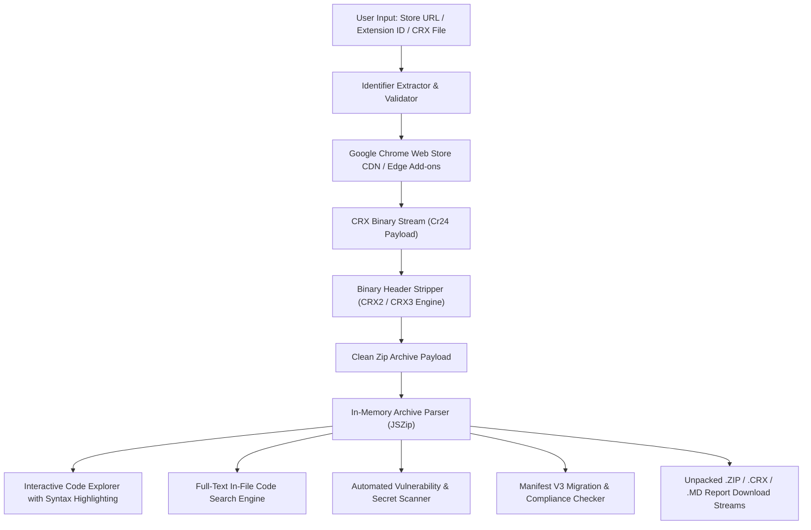

> [!NOTE]
> **[GetCRX is Live](https://getcrx.vercel.app):** In-browser Chrome Extension unpacker, live code explorer, vulnerability scanner, hardcoded secret detector, Manifest V3 analyzer, and security auditor.

# GetCRX — Unpacked
### High-Performance Chrome Extension Extractor & Security Inspector

**Extract, inspect, search, and audit the source code and security attack surface of any Chrome Web Store extension in real-time.**

 

---

> [!TIP]
> **Use the official hosted application:** Access the tool directly at **[getcrx.vercel.app](https://getcrx.vercel.app)**. No installation or account is required.

---

## Table of Contents

- [Overview](#overview)
- [Key Features](#key-features)
- [Deep Security & Vulnerability Analysis](#deep-security--vulnerability-analysis)
- [Interactive Code Explorer & Search](#interactive-code-explorer--search)
- [Manifest V3 Migration Readiness](#manifest-v3-migration-readiness)
- [Architecture](#architecture)
- [How It Works](#how-it-works)
- [Quick Guide](#quick-guide)
- [Privacy & Compliance](#privacy--compliance)
- [Frequently Asked Questions](#frequently-asked-questions)
- [Terms & Intellectual Property](#terms--intellectual-property)
- [Author](#author)

---

## Overview

**GetCRX** is an in-browser platform engineered for security researchers, bug bounty hunters, extension developers, and reverse engineers to instantly fetch, unpack, inspect, and audit Google Chrome extensions.

Paste any Chrome Web Store link or 32-character extension ID. GetCRX communicates with Google's public update infrastructure, strips binary container headers (CRX2/CRX3), and delivers the clean unpacked source as a `.zip` archive or directly inside an interactive, syntax-highlighted code explorer equipped with real-time vulnerability scanning, secret detection, and MV3 health scoring.

---

## Key Features

- **⚡ Instant Binary Unpacking:** Converts any signed `.crx` binary package to a clean `.zip` archive in milliseconds.
- **🛡️ Automated Security Audit & Health Score:** Generates an overall security grade (`A+` to `F`) and scans for dangerous code patterns and permissions.
- **🔑 Hardcoded Secrets & Token Detector:** Scans files for exposed AWS keys, OpenAI tokens, Google Cloud API keys, GitHub tokens, Slack tokens, Stripe keys, and private keys.
- **💻 Syntax-Highlighted Code Viewer:** Tokenized syntax highlighting for JavaScript, TypeScript, JSON, HTML, and CSS with line numbers and jump-to-line highlighting.
- **🔎 Full-Text Code Search:** Search across all source code and files inside the extension to instantly locate API calls, functions, or sensitive strings.
- **📁 Collapsible Directory Tree:** Switch seamlessly between an expandable folder hierarchy view and a flat file list.
- **🌐 Localization (`_locales/`) Auto-Resolver:** Resolves `__MSG_appName__` placeholders from `_locales/en/messages.json` automatically for accurate metadata.
- **🔥 Manifest V3 Migration Readiness:** Audits legacy MV2 fields (`background.scripts`, `browser_action`, `webRequestBlocking`) and provides actionable migration guidance.
- **📄 1-Click Security Report Export:** Download comprehensive security audit reports in clean Markdown (`.md`) format.
- **📦 Drag-and-Drop Local CRX Support:** Drop existing `.crx` or `.zip` files from your computer to inspect or unpack immediately.
- **⚡ Dual Download Modes & CLI Support:** Download raw signed `.crx` files, unpacked `.zip` source archives, formatted `manifest.json`, or copyable `curl` CLI commands.
- **🔒 Zero Server Storage:** 100% ephemeral in-memory processing. Nothing is stored, tracked, or saved on any server.

---

## Deep Security & Vulnerability Analysis

GetCRX classifies extension capabilities and potential attack surface into structured tiers:

| Severity | Category | Examples / Detection Rules | Threat Model / Potential Impact |
| :--- | :--- | :--- | :--- |
| **Critical** | **Secret Leaks** | AWS Keys (`AKIA...`), OpenAI (`sk-...`), Stripe Secret Keys (`sk_live_...`), Private Key blocks | Supply chain credential theft, cloud infrastructure compromise. |
| **High** | **Dangerous Sinks** | `eval()`, `new Function()`, `chrome.tabs.executeScript`, Insecure CSP `'unsafe-eval'` | Arbitrary code execution, DOM-based Cross-Site Scripting (XSS). |
| **High** | **Sensitive Perms** | `<all_urls>`, `*://*/*`, `webRequestBlocking`, `cookies`, `nativeMessaging`, `debugger` | Universal traffic interception, session hijacking, host binary execution. |
| **Medium** | **Attack Surface** | `innerHTML` assignments, unvalidated `window.postMessage` listeners, wildcard `web_accessible_resources` | Cross-origin message spoofing, extension fingerprinting, DOM injection. |
| **Medium** | **Broad Perms** | `tabs`, `storage`, `unlimitedStorage`, `scripting`, `clipboardRead`, `webNavigation` | Tab data extraction, local persistence, clipboard access. |
| **Low / Safe** | **Standard APIs** | `alarms`, `contextMenus`, `idle`, `offscreen`, `sidePanel` | UI extensions and timer-based scheduling. |

---

## Interactive Code Explorer & Search

The built-in Code Explorer provides a full IDE-like reverse engineering experience in the browser:

1. **Tree & Flat Views:** Toggle between hierarchical folder trees and flat file listings.
2. **Syntax Highlighting & Line Numbers:** Clear tokenization for scripts, markup, stylesheets, and manifest files.
3. **Full-Text In-File Search:** Real-time search across all files in the archive to find functions, endpoints, or variables.
4. **Click-to-Line Jump:** Jump straight from security audit findings to the exact vulnerable code line.
5. **Asset Preview:** Direct preview for PNG, JPEG, SVG, WebP, and ICO icons.

---

## Manifest V3 Migration Readiness

With Google Chrome phasing out Manifest V2, GetCRX evaluates compliance with modern Chromium standards:

- **Service Worker Check:** Validates background migration from persistent pages to service workers.
- **Declarative Net Request:** Identifies deprecated blocking `webRequest` usage.
- **Action API Unification:** Flags legacy `browser_action` and `page_action` declarations.
- **Object CSP Compliance:** Ensures Content Security Policy adheres to MV3 dictionary specifications.

---

## Architecture

---

## Quick Guide

1. Visit **[getcrx.vercel.app](https://getcrx.vercel.app)**.
2. Paste the extension URL or 32-character ID (e.g., `ddkjiahejlhfcafbddmgiahcphecmpfh` for *uBlock Origin Lite*).
3. Click **Look up**.
4. View extension metadata, audit permissions, explore files with syntax highlighting, scan for secrets, or click **Get Source (.zip)** to download.

---

## Privacy & Compliance

- **No Data Retention:** No IP logs, search queries, or extracted packages are persisted to databases or disk.
- **Public Artifacts Only:** Interacts exclusively with public packages served directly by Google's public infrastructure.
- **Client Discretion:** Users are responsible for complying with the software licenses and intellectual property terms of individual extensions.

---

## Frequently Asked Questions

<strong>Is any software installed on my machine?</strong>

No. GetCRX operates 100% inside your web browser. There are no extensions or executables to install.

<strong>Does this support Manifest V3 extensions?</strong>

Yes. GetCRX fully supports both Manifest V2 and modern Manifest V3 packages with CRX3 binary formatting.

<strong>Can I test local .crx or .zip files?</strong>

Yes. Drag and drop any <code>.crx</code> or <code>.zip</code> file from your computer directly into the app interface to inspect and audit it.

<strong>How does secret scanning work?</strong>

GetCRX runs static heuristic regex analysis across all script and text files in memory to identify leaked credentials such as AWS keys, OpenAI tokens, and private keys.

---

## Terms & Intellectual Property

> [!CAUTION]
> **Proprietary Software — All Rights Reserved.**
> 
> This web application, its design, security inspection logic, and user interface are the intellectual property of **JOJIN JOHN**.
> 
> - **Usage:** Free to use online at **[getcrx.vercel.app](https://getcrx.vercel.app)**.
> - **Restrictions:** Unauthorized cloning, copying, reproduction, mirroring, scraping, or redistribution of this application or its code is strictly prohibited.

---

## Author

**Developed by [JOJIN JOHN](https://getcrx.vercel.app)**  
*Software Engineer • Security Researcher • Ethical Hacker*
