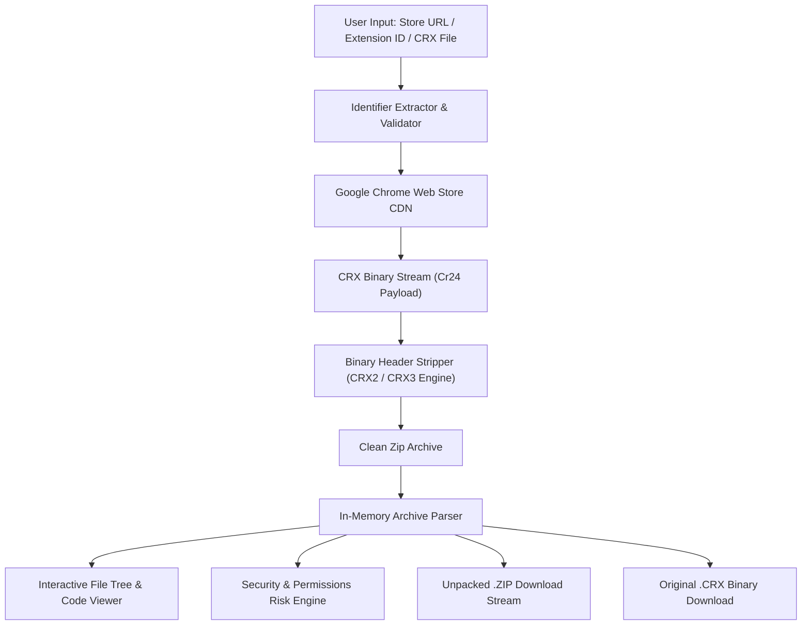

> [!NOTE]
> **[GetCRX v2.0 is Live](https://getcrx.vercel.app):** In-browser Chrome Extension unpacker, source code explorer, Manifest V3 analyzer, and security permission auditor.

# GetCRX — Unpacked
### High-Performance Chrome Extension Extractor & Security Inspector

**Extract, inspect, and analyze the raw source code of any Chrome Web Store extension in real-time.**

 

---

> [!TIP]
> **Use the official hosted application:** Access the tool directly at **[getcrx.vercel.app](https://getcrx.vercel.app)**. No installation or account is required.

---

## Table of Contents

- [Overview](#overview)
- [Key Features](#key-features)
- [How It Works](#how-it-works)
- [Architecture](#architecture)
- [Security & Permission Analysis](#security--permission-analysis)
- [Quick Guide](#quick-guide)
- [Privacy & Compliance](#privacy--compliance)
- [Frequently Asked Questions](#frequently-asked-questions)
- [Terms & Intellectual Property](#terms--intellectual-property)
- [Author](#author)

---

## Overview

**GetCRX** is an in-browser platform engineered for security researchers, bug bounty hunters, and developers to instantly fetch, unpack, inspect, and audit Google Chrome extensions.

Paste any Chrome Web Store link or 32-character extension ID. GetCRX communicates with Google's public update infrastructure, strips binary container headers (CRX2/CRX3), and delivers the clean unpacked source as a `.zip` archive or directly within an interactive in-browser file and code explorer.

---

## Key Features

- **Instant Extraction:** Converts any `.crx` binary package to a standard `.zip` archive within milliseconds.
- **In-Browser File Explorer & Code Viewer:** Inspect `manifest.json`, background service workers, content scripts, and assets without downloading files to disk.
- **Security & Permission Risk Scoring:** Evaluates extension attack surface by classifying permissions into High, Medium, and Low risk tiers (`<all_urls>`, `webRequest`, `cookies`, `nativeMessaging`).
- **Drag-and-Drop Local CRX Support:** Drop existing `.crx` or `.zip` files from your computer to inspect or unpack immediately.
- **Dual Download Modes:** Download raw signed `.crx` binaries or unpacked `.zip` source archives.
- **CLI & Deep Link Ready:** Automated query support via URL parameters (`?id=<extension_id>`) and copyable `curl` commands.
- **Zero Server Storage:** 100% ephemeral in-memory processing. Nothing is stored, tracked, or saved on any server.

---

## How It Works

1. **Identifier Resolution:** Parses the 32-character extension ID from URLs, store links, or bare hash strings.
2. **Package Retrieval:** Connects to Google's public update CDN (`clients2.google.com`) using Chrome's native update protocol.
3. **Binary Header Stripping:** Parses magic bytes (`Cr24`) and strips the 12-to-16 byte signature header (CRX2 / CRX3).
4. **Source Reconstruction & Audit:** Validates the underlying zip payload, generates file trees, analyzes manifest permissions, and streams the verified source.

---

## Architecture

---

## Security & Permission Analysis

GetCRX categorizes extension capabilities into structured risk tiers for security audits:

| Severity | Permission Examples | Threat Model / Potential Impact |
| :--- | :--- | :--- |
| **High Risk** | `<all_urls>`, `*://*/*`, `webRequestBlocking`, `cookies`, `nativeMessaging`, `debugger` | Full traffic interception, cookie theft, DOM hijacking, local binary execution. |
| **Medium Risk** | `tabs`, `storage`, `unlimitedStorage`, `scripting`, `clipboardRead`, `webNavigation` | Tab manipulation, local persistence, cross-origin script injection, clipboard access. |
| **Low / Safe** | `alarms`, `contextMenus`, `idle`, `offscreen`, `sidePanel` | UI extensions and timer-based scheduling. |

---

## Quick Guide

1. Visit **[getcrx.vercel.app](https://getcrx.vercel.app)**.
2. Paste the extension URL or 32-character ID (e.g., `cjpalhdlnbpafiamejdnhcphjbkeiagm` for *uBlock Origin*).
3. Click **Look up**.
4. View extension metadata, audit permissions, explore files in the browser, or click **Get Source (.zip)** to download.

---

## Privacy & Compliance

- **No Data Retention:** No IP logs, search queries, or extracted packages are persisted to databases or disk.
- **Public Artifacts Only:** Interacts exclusively with public packages served directly by Google's public infrastructure.
- **Client Discretion:** Users are responsible for complying with the software licenses and intellectual property terms of individual extensions.

---

## Frequently Asked Questions

<strong>Is any software installed on my machine?</strong>

No. GetCRX operates 100% inside your web browser. There are no extensions or executables to install.

<strong>Does this support Manifest V3 extensions?</strong>

Yes. GetCRX fully supports both Manifest V2 and modern Manifest V3 packages with CRX3 binary formatting.

<strong>Can I test local .crx files?</strong>

Yes. Drag and drop any <code>.crx</code> file from your computer directly into the app interface to inspect and unpack it.

---

## Terms & Intellectual Property

> [!CAUTION]
> **Proprietary Software — All Rights Reserved.**
> 
> This web application, its design, security inspection logic, and user interface are the intellectual property of **JOJIN JOHN**.
> 
> - **Usage:** Free to use online at **[getcrx.vercel.app](https://getcrx.vercel.app)**.
> - **Restrictions:** Unauthorized cloning, copying, reproduction, mirroring, scraping, or redistribution of this application or its code is strictly prohibited.

---

## Author

**Developed by [JOJIN JOHN](https://getcrx.vercel.app)**  
*Software Engineer • Security Researcher • Ethical Hacker*
